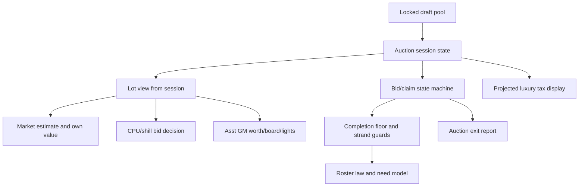

# GM Intelligence Engine Map

Generated: 2026-07-06

Scope: read-only discovery of roster intelligence, draft guide logic, chemistry/personality, archetypes, salary/tax, CPU/shill bidding, and the way those concepts should map into the auction sim. This document describes current code paths only. It does not propose or apply production behavior changes.

Status key:

- `VERIFIED`: the claim is directly backed by cited code.
- `UNKNOWN`: the current inspected code does not prove the behavior.
- `NEEDS_DECISION`: the code exposes a product ambiguity that needs JK direction.

Evidence format: `path:line-range` plus the relevant function, type, or constant.

## Plain Bottom Line

There is no single unified "GM intelligence engine" today. The repo has a network of specialized engines:

- Hard roster law: `rosterConstruction`, `rosterNeed`, `auctionCompletionFloor`, `auctionStateMachine`, and `auctionExitGate`.
- Design feasibility and pool logic: `rosterDesignFeasibility`, `poolFromDemand`, `draftPoolExtractor`, `auctionPoolSizing`, and `leagueBuilderPoolBuilder`.
- Advisory GM intelligence: `rosterAnalyzerEngine`, `auctionMarketModel`, `rosterIntelligencePayload`, and `LeagueBuilderAuctionDraft`.
- CPU/shill behavior: `cpuShillBidding` plus shared market/session ceiling inputs.
- Chemistry and personality: mostly advisory/morale/design-soft-ordering, not core auction economy.
- Sim harness: now has numeric-grade pool diagnostics and scenario matrix code, but it remains isolated under `src/engines/auctionSim/`.

The next sim step should not guess a new GM model from scratch. It should assemble a layered marginal-value bidder from the existing law/value pieces: legal completion first, then marginal roster value, archetype fit, scarcity/opponent pressure, and finally optional chemistry/personality/tax modules once JK decides whether those should affect auction price.

## Glossary

| Term | Meaning | Evidence | Status |
|---|---|---|---|
| Legal roster | A 22-player roster satisfying canonical composition, position coverage, catcher depth, starter, reliever, and closer floors. | `src/data/rosterConstruction.ts:1-27` module contract; `src/data/rosterConstruction.ts:29-45` `LEGAL_ROSTER`; `src/data/rosterConstruction.ts:126-155` `isLegalRoster` | VERIFIED |
| Seating | Assigning available players into roster slots/design asks while respecting legal and budget constraints. | `src/engines/rosterDesignFeasibility.ts:555-824` `seatAllClubs` | VERIFIED |
| IV | Internal value/roster-strength value used by auction, balance, and sim systems. | `src/engines/archetypeBalanceSimulator.ts:38-53` `SimPlayer`; `src/engines/auctionMarketModel.ts:270-369` `estimateMarketWithInternals`; `src/engines/auctionSim/metrics.ts:49-78` `buildRosterStrengthMetrics` | VERIFIED |
| Numeric analyzer grade | Canonical numeric grade produced by SMB4 grade emulator before display letter conversion. | `src/engines/smb4GradeEmulator.ts:81-90` `Smb4GradeResult`; `src/engines/smb4GradeEmulator.ts:671-687` `scoreSmb4Player`; `src/engines/auctionSim/poolDiagnostics.ts:72-90` `resolveNumericGrade` | VERIFIED |
| Letter grade | Human-readable label derived from numeric grade or stored/display grade. | `src/engines/smb4GradeEmulator.ts:1-19` `SMB4_FULL_GRADE_SCALE`; `src/utils/leagueBuilderPoolBuilder.ts:142-165` `computePlayerGrade`; `src/engines/auctionSim/poolDiagnostics.ts:192-199` `letterGradeSummary` | VERIFIED |
| Archetype | Team identity model that sets priority bands and cap identity. | `src/data/historicalArchetypes.ts:1-10` module contract; `src/data/historicalArchetypes.ts:49-175` `HISTORICAL_ARCHETYPES`; `src/engines/archetypeIdentity.ts:31-103` `archetypeToCapIdentity`, `resolveClubBandPriorities`, `selectTeamArchetype` | VERIFIED |
| Chemistry tipping premium | Advisory premium for adding a player whose chemistry family crosses a tier. | `src/engines/chemistryTierValue.ts:1-18` module contract; `src/engines/chemistryTierValue.ts:120-176` `chemistryTipPremium` | VERIFIED |
| CPU personality | Bidder profile behavior, separate from player personality. | `src/engines/cpuShillBidding.ts:28-48` `CpuShillProfile`; `src/engines/cpuShillBidding.ts:136-177` `CPU_SHILL_PERSONALITY_PROFILES` | VERIFIED |
| Player personality | Stored player attribute used by classifier, design soft preferences, morale, and trait grant systems. | `src/utils/leagueBuilderStorage.ts:304-380` `Player`; `src/data/playerArchetypeTaxonomy.ts:316-346` `PersonalityGroup`, `PERSONALITY_GROUPS`, `PersonalityTilt`; `src/engines/rosterDesignFeasibility.ts:197-212` `personalityTiltPenalty` | VERIFIED |
| Completion floor | Minimum cost to finish a legal roster from remaining pool. | `src/engines/auctionCompletionFloor.ts:1-22` module contract; `src/engines/auctionCompletionFloor.ts:329-441` `attemptCompletion`; `src/engines/auctionCompletionFloor.ts:443-464` `cheapestLegalCompletion` | VERIFIED |
| Pool-first | Manual/import pool mode based on league assignments and selected branded team rosters, not a re-extraction engine. | `src/utils/leagueBuilderPoolBuilder.ts:1-15` module contract; `src/utils/leagueBuilderPoolBuilder.ts:239-265` `importRosteredPlayersToLeaguePool`; `src/src_figma/app/pages/LeagueBuilderDraftSetup.tsx:2444-2482` pool-first UI | VERIFIED |
| Design-first | Demand-based pool extraction from locked designs and selected archetypes. | `src/engines/poolFromDemand.ts:488-687` `extractPoolFromDemand`; `src/src_figma/app/pages/LeagueBuilderDraftSetup.tsx:1368-1398` `handleExtractPool`; `src/src_figma/app/pages/LeagueBuilderDraftSetup.tsx:2285-2307` design-first re-extract UI | VERIFIED |

## Current Draft Decision Paths

| Flow claim | Evidence | Status |
|---|---|---|
| Live auction loads the locked pool, clears team rosters, creates real and shill teams, configures shills as non-completing, and persists the session. | `src/src_figma/app/hooks/useAuctionDraft.ts:584-664` `initAuction` | VERIFIED |
| The live auction page builds lot views, market reads, own worth, bid-vs-pass projection, board entries, five lights, and the roster intelligence payload from session state. | `src/src_figma/app/pages/LeagueBuilderAuctionDraft.tsx:1000-1175` intelligence payload assembly | VERIFIED |
| Bid legality goes through auction state machine ceilings and strand checks rather than the UI alone. | `src/engines/auctionStateMachine.ts:273-338` `sessionBidCeiling`; `src/engines/auctionStateMachine.ts:404-453` `bidWouldStrand`; `src/engines/auctionStateMachine.ts:455-483` `recordBid` | VERIFIED |
| CPU/shill decisions are a separate behavior path but use the same session lot/player/team context. | `src/src_figma/app/pages/LeagueBuilderAuctionDraft.tsx:911-930` CPU preview; `src/src_figma/app/pages/LeagueBuilderAuctionDraft.tsx:1529-1541` CPU action; `src/engines/cpuShillBidding.ts:324-395` `cpuBidOnLot` | VERIFIED |
| Auction exit reporting uses the roster law/need model to describe final blockers. | `src/engines/auctionExitGate.ts:1-6` imports; `src/engines/auctionExitGate.ts:57-83` `describeRosterLawGaps`; `src/engines/auctionExitGate.ts:85-130` `buildAuctionExitReport` | VERIFIED |

## 1. Roster Legality and Seating

| Question / claim | Evidence | Status |
|---|---|---|
| Roster size rules are canonicalized as 22 players with 13-14 position players and 8-9 pitchers. | `src/data/rosterConstruction.ts:1-27` module contract; `src/data/rosterConstruction.ts:29-45` `LEGAL_ROSTER` | VERIFIED |
| Positional requirements require primary coverage for all eight field positions and catcher depth of two, including secondary catcher or two-way catcher support. | `src/data/rosterConstruction.ts:1-27` module contract; `src/data/rosterConstruction.ts:108-124` `canCover`; `src/data/rosterConstruction.ts:126-155` `isLegalRoster` | VERIFIED |
| Bench/depth requirements beyond catcher depth are soft warnings, not hard legality. | `src/data/rosterConstruction.ts:1-27` module contract; `src/data/rosterConstruction.ts:157-182` `depthReport` | VERIFIED |
| Pitcher roles are represented by startable, relievable, and closer predicates. | `src/data/rosterConstruction.ts:83-96` `canStart`, `canRelieve`, `isCloser`; `src/engines/rosterNeed.ts:102-127` `classifyArms` | VERIFIED |
| Starter/reliever/closer hard constraints are at least four startable arms, four relievable arms, and one closer. | `src/data/rosterConstruction.ts:1-27` module contract; `src/data/rosterConstruction.ts:126-155` `isLegalRoster` | VERIFIED |
| Team need breakdown uses the same hard-law concepts and is intentionally permissive when player role data is missing. | `src/engines/rosterNeed.ts:1-22` module contract; `src/engines/rosterNeed.ts:72-100` `RosterNeedBreakdown`; `src/engines/rosterNeed.ts:143-214` `rosterNeedBreakdown` | VERIFIED |
| `seatAllClubs` is the global design seating evaluator; it seats clubs with matching, budget repair, and legal failure diagnostics. | `src/engines/rosterDesignFeasibility.ts:555-824` `seatAllClubs` | VERIFIED |
| Design-first pool extraction uses seating as a G1 feasibility check and repair input. | `src/engines/poolFromDemand.ts:345-356` `runG1Check`; `src/engines/poolFromDemand.ts:359-456` `repairG1PoolForSizing`; `src/engines/poolFromDemand.ts:603-676` sizing/repair path | VERIFIED |
| Legal roster and strong roster are separate concepts: legality is hard composition/coverage, while strength is IV/rating/advisory value. | `src/data/rosterConstruction.ts:126-155` `isLegalRoster`; `src/engines/rosterAnalyzerEngine.ts:634-674` `buildProfile`; `src/engines/auctionSim/metrics.ts:49-78` `buildRosterStrengthMetrics` | VERIFIED |
| Human and CPU real-team rosters are constrained through the same auction state machine; shills can be marked non-completing. | `src/src_figma/app/hooks/useAuctionDraft.ts:631-646` `initAuction` config; `src/engines/auctionStateMachine.ts:273-338` `sessionBidCeiling`; `src/engines/auctionStateMachine.ts:455-483` `recordBid` | VERIFIED |
| Draft guide legality uses the same underlying roster law inputs indirectly through roster need, completion ceiling, and lot view/session state; the standalone preview card is not the authority. | `src/engines/rosterIntelligencePayload.ts:1-54` imports; `src/engines/rosterIntelligencePayload.ts:238-281` `assembleWorthToYou`; `src/src_figma/app/pages/DraftGuidePreview.tsx:4-9` mock-fed preview route | VERIFIED |

## 2. Positional and Role Intelligence

| Question / claim | Evidence | Status |
|---|---|---|
| Team needs by position and role are computed in `rosterNeedBreakdown`. | `src/engines/rosterNeed.ts:72-100` `RosterNeedBreakdown`; `src/engines/rosterNeed.ts:143-214` `rosterNeedBreakdown`; `src/engines/rosterNeed.ts:250-260` `teamRosterNeed` | VERIFIED |
| The app distinguishes hard requirement filling from general roster quality. | `src/engines/rosterNeed.ts:262-287` `playerFillsHardRequirement`; `src/engines/rosterNeed.ts:230-248` `wouldStrandRoster` | VERIFIED |
| Design seating distinguishes specific position slots, backup catcher, SP, RP, CP, FLEX, and SWING slots. | `src/engines/rosterDesignFeasibility.ts:70-80` `buildDefaultDesignSlots`; `src/engines/rosterDesignFeasibility.ts:224-255` `eligibleForSlot` | VERIFIED |
| The analyzer separately evaluates position coverage, rotation, bullpen, lineup, and pitch arsenal, but it is advisory. | `src/engines/rosterAnalyzerEngine.ts:862-885` position coverage; `src/engines/rosterAnalyzerEngine.ts:888-913` rotation; `src/engines/rosterAnalyzerEngine.ts:915-929` bullpen; `src/engines/rosterAnalyzerEngine.ts:931-949` lineup; `src/engines/rosterAnalyzerEngine.ts:951-980` pitch arsenal | VERIFIED |
| Defensive positions and two-way/catcher flexibility are represented in roster law and design eligibility. | `src/data/rosterConstruction.ts:108-124` `canCover`; `src/engines/rosterDesignFeasibility.ts:224-255` `eligibleForSlot` | VERIFIED |
| Handedness and lineup balance are not proven as hard auction legality inputs in the inspected auction law path. | `src/engines/rosterNeed.ts:143-214` `rosterNeedBreakdown`; `src/engines/auctionStateMachine.ts:404-453` `bidWouldStrand`; `src/engines/rosterAnalyzerEngine.ts:931-949` lineup advisory | UNKNOWN |
| Replacement level by position is not proven as a current auction bidding primitive. The current cited paths use roster law, IV, fit, need, scarcity, and completion cost. | `src/engines/auctionMarketModel.ts:270-369` `estimateMarketWithInternals`; `src/engines/auctionMarketModel.ts:491-570` `buildLotViewFromSession`; `src/engines/auctionCompletionFloor.ts:443-464` `cheapestLegalCompletion` | UNKNOWN |
| Remaining-pool scarcity is computed for auction lot views and tight class protection. | `src/engines/auctionMarketModel.ts:491-570` `buildLotViewFromSession`; `src/engines/auctionStateMachine.ts:795-827` `jointClassView`; `src/engines/auctionStateMachine.ts:829-873` `candidateServesTightClass` | VERIFIED |
| The system knows when a team has enough in the sense of no hard-law gap and full slots; richer duplicate/blocking penalties are not proven as a unified value penalty. | `src/engines/rosterNeed.ts:143-214` `rosterNeedBreakdown`; `src/engines/auctionStateMachine.ts:273-338` `sessionBidCeiling`; `src/engines/auctionMarketModel.ts:270-369` `estimateMarketWithInternals` | UNKNOWN |

## 3. Roster Strength Model

| Question / claim | Evidence | Status |
|---|---|---|
| There is no single roster strength function shared by draft guide, CPU bidding, roster builder, league balance checks, and UI summaries. | `src/engines/rosterAnalyzerEngine.ts:634-674` `buildProfile`; `src/engines/archetypeBalanceSimulator.ts:298-332` `buildBestRoster`; `src/engines/auctionMarketModel.ts:270-369` `estimateMarketWithInternals`; `src/engines/auctionSim/metrics.ts:49-78` `buildRosterStrengthMetrics` | VERIFIED |
| Archetype balance simulation uses legal roster construction and total IV/salary/tax as strength and solvency outputs. | `src/engines/archetypeBalanceSimulator.ts:38-53` `SimPlayer`; `src/engines/archetypeBalanceSimulator.ts:298-332` `buildBestRoster`; `src/engines/archetypeBalanceSimulator.ts:766-869` `buildIdentityRoster` | VERIFIED |
| Auction sim roster strength currently sums roster IV by team and measures spread around the mean. | `src/engines/auctionSim/metrics.ts:49-78` `buildRosterStrengthMetrics` | VERIFIED |
| Roster analyzer profile uses rating averages, average overall, top-N share, chemistry counts, trait counts, and salary total. | `src/engines/rosterAnalyzerEngine.ts:634-674` `buildProfile`; `src/engines/rosterAnalyzerEngine.ts:982-993` team profile/top-heavy checks | VERIFIED |
| SMB4 analyzer grade exists as numeric plus letter output, but it is not proven as the universal roster-strength metric in live auction logic. | `src/engines/smb4GradeEmulator.ts:81-90` `Smb4GradeResult`; `src/engines/smb4GradeEmulator.ts:671-687` `scoreSmb4Player`; `src/engines/auctionMarketModel.ts:270-369` `estimateMarketWithInternals` | VERIFIED |
| Salary affects strength-adjacent solvency and advice, but salary is not the same as roster strength. | `src/engines/rosterAnalyzerEngine.ts:1037-1065` salary/luxury advisory; `src/engines/leagueConstruction.ts:405-460` `assessSolvency`; `src/engines/auctionCompletionFloor.ts:329-441` `attemptCompletion` | VERIFIED |
| Position fit and role fit affect design seating, need, completion cost, and advice. | `src/engines/rosterDesignFeasibility.ts:224-255` `eligibleForSlot`; `src/engines/rosterNeed.ts:262-287` `playerFillsHardRequirement`; `src/engines/rosterIntelligencePayload.ts:312-334` `assembleBoard` | VERIFIED |
| Archetype fit affects perceived market/player value and CPU bidding, but it is not the same as generic roster strength. | `src/engines/auctionMarketModel.ts:270-369` `estimateMarketWithInternals`; `src/engines/auctionMarketModel.ts:423-438` `computeOwnValueFactors`, `computeOwnValue`; `src/engines/cpuShillBidding.ts:224-235` `evaluateCpuArchetypeFit` | VERIFIED |
| Chemistry affects Asst GM advice through a positive premium, but the chemistry module explicitly says it does not feed IV, salary, market-price prediction, CPU/shill bidding, or archetype balance. | `src/engines/chemistryTierValue.ts:1-18` module contract; `src/engines/rosterIntelligencePayload.ts:238-281` `assembleWorthToYou` | VERIFIED |
| Player personality affects design ordering and morale/trait systems; no inspected live auction value function proves player personality changes bid price. | `src/engines/rosterDesignFeasibility.ts:197-212` `personalityTiltPenalty`; `src/engines/draftMorale.ts:62-78` `computeDraftMorale`; `src/engines/auctionMarketModel.ts:270-369` `estimateMarketWithInternals` | UNKNOWN |

## 4. Draft Guide / Asst GM Logic

| Question / claim | Evidence | Status |
|---|---|---|
| The visible reusable `DraftGuideCard` is a UI card; its preview route is mock-fed and not the live auction calculation authority. | `src/src_figma/app/components/draft/DraftGuideCard.tsx:4-15` module contract; `src/src_figma/app/pages/DraftGuidePreview.tsx:4-9` mock-fed preview route; `src/src_figma/app/pages/DraftGuidePreview.tsx:11-49` mock data | VERIFIED |
| Live Asst GM logic is assembled through `rosterIntelligencePayload` inside `LeagueBuilderAuctionDraft`. | `src/engines/rosterIntelligencePayload.ts:126-133` `RosterIntelligencePayload`; `src/src_figma/app/pages/LeagueBuilderAuctionDraft.tsx:1000-1175` payload assembly | VERIFIED |
| Worth-to-you uses current roster, candidate, available budget/slots, remaining pool, club band priorities, chemistry advice, own value factors, and completion bid ceiling. | `src/engines/rosterIntelligencePayload.ts:238-281` `assembleWorthToYou`; `src/src_figma/app/pages/LeagueBuilderAuctionDraft.tsx:1033-1048` call site | VERIFIED |
| The guide considers current roster and remaining pool. | `src/src_figma/app/pages/LeagueBuilderAuctionDraft.tsx:1009-1022` remainingPool; `src/engines/rosterIntelligencePayload.ts:238-281` `assembleWorthToYou`; `src/engines/rosterIntelligencePayload.ts:312-334` `assembleBoard` | VERIFIED |
| The guide considers remaining budget and slots through session/team state and completion ceiling. | `src/engines/auctionMarketModel.ts:491-570` `buildLotViewFromSession`; `src/engines/rosterIntelligencePayload.ts:259-267` `assembleWorthToYou`; `src/engines/auctionCompletionFloor.ts:486-500` `completionBidCeiling` | VERIFIED |
| The guide considers positional scarcity and rival teams through lot view, market estimate, and bid-vs-pass projection. | `src/engines/auctionMarketModel.ts:491-570` `buildLotViewFromSession`; `src/engines/auctionMarketModel.ts:270-369` `estimateMarketWithInternals`; `src/engines/auctionMarketModel.ts:687-803` `projectBidVsPass`; `src/src_figma/app/pages/LeagueBuilderAuctionDraft.tsx:1050-1064` projection call | VERIFIED |
| The guide considers archetype through band priorities and own value factors. | `src/engines/archetypeIdentity.ts:49-82` `resolveClubBandPriorities`; `src/engines/auctionMarketModel.ts:423-438` `computeOwnValueFactors`, `computeOwnValue`; `src/engines/rosterIntelligencePayload.ts:576-607` `identityLight` | VERIFIED |
| Chemistry is used in Asst GM worth and five-light advice; player personality is not proven as a live Asst GM bid-price input. | `src/engines/rosterIntelligencePayload.ts:238-281` `assembleWorthToYou`; `src/engines/rosterIntelligencePayload.ts:461-515` `chemistryLight`, `chemistryTraitPressure`; `src/engines/auctionMarketModel.ts:270-369` `estimateMarketWithInternals` | UNKNOWN |
| The guide generates bid recommendation numbers through worth and completion cap; it also generates player board rankings. | `src/engines/rosterIntelligencePayload.ts:267-281` `assembleWorthToYou`; `src/engines/rosterIntelligencePayload.ts:312-334` `assembleBoard` | VERIFIED |
| The guide explains recommendations with worth verdicts and five lights. | `src/engines/rosterIntelligencePayload.ts:381-399` `worthVerdict`; `src/engines/rosterIntelligencePayload.ts:401-435` `shapeLight`; `src/engines/rosterIntelligencePayload.ts:531-566` `budgetLight`; `src/engines/rosterIntelligencePayload.ts:576-612` `identityLight`, `balanceLight` | VERIFIED |
| The guide is seat-aware because it consumes hard requirements, completion ceiling, slots, and remaining pool, but it is not a full future-auction optimizer. | `src/engines/rosterNeed.ts:262-287` `playerFillsHardRequirement`; `src/engines/auctionCompletionFloor.ts:486-500` `completionBidCeiling`; `src/engines/rosterIntelligencePayload.ts:238-281` `assembleWorthToYou` | VERIFIED |
| Human advice and CPU behavior share some market/session value inputs, but they are separate paths. | `src/engines/auctionMarketModel.ts:270-369` `estimateMarketWithInternals`; `src/engines/rosterIntelligencePayload.ts:238-281` `assembleWorthToYou`; `src/engines/cpuShillBidding.ts:324-395` `cpuBidOnLot` | VERIFIED |

## 5. Archetype Model

| Question / claim | Evidence | Status |
|---|---|---|
| A team's selected archetype and cap identity are stored on the league-builder `Team` model. | `src/utils/leagueBuilderStorage.ts:147-201` `Team` | VERIFIED |
| Canonical archetypes and their boosted/nerfed stat bands are defined in `historicalArchetypes`. | `src/data/historicalArchetypes.ts:1-10` module contract; `src/data/historicalArchetypes.ts:11-47` `HistoricalArchetype`; `src/data/historicalArchetypes.ts:49-175` `HISTORICAL_ARCHETYPES` | VERIFIED |
| Archetype boosts/nerfs are numerical and translate into cap identity shifts. | `src/data/historicalArchetypes.ts:177-184` `archetypeCapShift`; `src/engines/archetypeIdentity.ts:31-47` `archetypeToCapIdentity` | VERIFIED |
| Archetype priorities are resolved into offensive/defensive/speed/pitching band priorities. | `src/engines/archetypeIdentity.ts:49-82` `resolveClubBandPriorities`; `src/engines/archetypeIdentity.ts:84-103` `selectTeamArchetype` | VERIFIED |
| Archetype changes perceived player value through fit/lift models used by market and CPU bidding. | `src/engines/auctionMarketModel.ts:191-198` `buildArchetypeLiftTable`; `src/engines/auctionMarketModel.ts:270-369` `estimateMarketWithInternals`; `src/engines/cpuShillBidding.ts:224-235` `evaluateCpuArchetypeFit` | VERIFIED |
| Archetype can change luxury tax exposure through shifted caps, not through changing the player's salary directly. | `src/engines/auctionLuxuryTax.ts:15-20` `auctionShiftedCaps`; `src/engines/leagueConstruction.ts:236-243` `shiftLuxuryCaps`; `src/engines/auctionLuxuryTax.ts:34-43` `computeAuctionTeamProjectedTaxWithCaps` | VERIFIED |
| Archetype is used in design pool extraction floors and identity seating. | `src/engines/poolFromDemand.ts:576-580` archetype floors; `src/engines/archetypeBalanceSimulator.ts:766-869` `buildIdentityRoster` | VERIFIED |
| Archetype affects draft guide advice. | `src/engines/rosterIntelligencePayload.ts:576-607` `identityLight`; `src/engines/auctionMarketModel.ts:423-438` `computeOwnValueFactors`, `computeOwnValue` | VERIFIED |
| Archetype affects CPU bidding. | `src/engines/cpuShillBidding.ts:224-235` `evaluateCpuArchetypeFit`; `src/engines/cpuShillBidding.ts:479-532` `archetypeBandPriorities`, `buildArchetypeShillProfile`, `buildClubCpuProfile` | VERIFIED |
| Whether archetype-adjusted value should define "overpay" or tax liability is not settled by current code. | `src/engines/auctionLuxuryTax.ts:10-14` module contract; `src/engines/leagueConstruction.ts:252-280` `luxuryTax`; `src/engines/auctionMarketModel.ts:423-438` `computeOwnValueFactors`, `computeOwnValue` | NEEDS_DECISION |

## 6. Chemistry Trait-Potencies

| Question / claim | Evidence | Status |
|---|---|---|
| Chemistry traits are stored on `Player` and trait pricing data is generated data. | `src/utils/leagueBuilderStorage.ts:304-380` `Player`; `src/data/traitPricing.ts:1-17` module contract; `src/data/traitPricing.ts:19-32` trait pricing types/data start | VERIFIED |
| Trait potency tiers derive from roster chemistry counts using L2 and L3 thresholds. | `src/engines/derivedTraitPotency.ts:13-14` `POTENCY_L2_MIN`, `POTENCY_L3_MIN`; `src/engines/derivedTraitPotency.ts:32-37` `derivedPotencyTier`; `src/engines/derivedTraitPotency.ts:51-83` `traitPotencies` | VERIFIED |
| Potency scale constants exist, but the comments/data lineage contain a possible stale-scale mismatch that needs product/source-of-truth confirmation. | `src/data/rosterEngineConstants.ts:35-51` `POTENCY_SCALE`; `src/data/traitPricing.ts:1-17` module contract | NEEDS_DECISION |
| Chemistry tipping is threshold-based and incremental: it compares before/after family counts and tier crossings. | `src/engines/chemistryTierValue.ts:79-89` `FamilyChemistryProfile`; `src/engines/chemistryTierValue.ts:120-176` `chemistryTipPremium` | VERIFIED |
| Chemistry removal impact is modeled separately. | `src/engines/chemistryTierValue.ts:178-226` `chemistryRemovalImpact` | VERIFIED |
| Chemistry affects draft guide/advice through chemistry advice and positive premium. | `src/utils/chemistryIntelligence.ts:43-56` `chemistryAdviceForCandidate`; `src/engines/rosterIntelligencePayload.ts:238-281` `assembleWorthToYou` | VERIFIED |
| Chemistry module explicitly says it does not affect IV, salary, market-price prediction, CPU/shill bidding, or archetype balance. | `src/engines/chemistryTierValue.ts:1-18` module contract; `src/utils/chemistryIntelligence.ts:1-18` module contract | VERIFIED |
| Chemistry conflicts/synergies beyond family count/tier pressure are not proven in inspected auction decision logic. | `src/engines/chemistryTierValue.ts:120-176` `chemistryTipPremium`; `src/engines/rosterIntelligencePayload.ts:461-515` `chemistryLight`, `chemistryTraitPressure` | UNKNOWN |
| Whether chemistry should be strong enough to affect auction price is a product decision, not current production behavior. | `src/engines/chemistryTierValue.ts:1-18` module contract; `src/engines/rosterIntelligencePayload.ts:238-281` `assembleWorthToYou`; `src/engines/cpuShillBidding.ts:324-395` `cpuBidOnLot` | NEEDS_DECISION |

## 7. Player Personality

| Question / claim | Evidence | Status |
|---|---|---|
| Player personality and hidden personality modifiers are stored on `Player`. | `src/utils/leagueBuilderStorage.ts:304-380` `Player` | VERIFIED |
| Personality group and tilt concepts are defined in player archetype taxonomy. | `src/data/playerArchetypeTaxonomy.ts:316-346` `PersonalityGroup`, `PERSONALITY_GROUPS`, `PersonalityTilt` | VERIFIED |
| The classifier reads player personality into profile tags. | `src/engines/playerArchetypeClassifier.ts:40-74` `ClassifiableProfile`, `ProfileTags`; `src/engines/playerArchetypeClassifier.ts:141-142` personalityGroup derivation | VERIFIED |
| Design feasibility uses player personality as a soft preference/ordering penalty, never as a hard filter. | `src/engines/rosterDesignFeasibility.ts:1-18` module contract; `src/engines/rosterDesignFeasibility.ts:58` `SlotPreference.personalityTilt`; `src/engines/rosterDesignFeasibility.ts:197-212` `personalityTiltPenalty`; `src/engines/rosterDesignFeasibility.ts:263-273` `candidateOrder` | VERIFIED |
| Personality affects morale calculations and draft morale. | `src/engines/masterMoraleMatrix.ts:11-18` `CanonicalPersonality`; `src/engines/masterMoraleMatrix.ts:204-254` personality multipliers; `src/engines/masterMoraleMatrix.ts:475-589` morale consequence/personality application; `src/engines/draftMorale.ts:62-78` `computeDraftMorale` | VERIFIED |
| Personality feeds trait grant roster computation. | `src/utils/franchiseTraitGrantCompute.ts:123-157` `resolveTraitGrantRoster` | VERIFIED |
| League pool personality/chemistry axes are regenerated and persisted for league pools. | `src/utils/leaguePoolAxisRegenPersist.ts:1-21` `regenerateLeaguePoolPlayerAxes` integration | VERIFIED |
| Player personality is not proven to affect live auction CPU bid price, salary, tax, or core market estimate. | `src/engines/auctionMarketModel.ts:270-369` `estimateMarketWithInternals`; `src/engines/cpuShillBidding.ts:324-395` `cpuBidOnLot`; `src/engines/auctionLuxuryTax.ts:34-43` `computeAuctionTeamProjectedTaxWithCaps` | UNKNOWN |
| CPU/shill personality is a separate bidder concept and does affect bid behavior. | `src/engines/cpuShillBidding.ts:28-48` `CpuShillProfile`; `src/engines/cpuShillBidding.ts:136-177` `CPU_SHILL_PERSONALITY_PROFILES`; `src/engines/cpuShillBidding.ts:179-191` `evaluateCpuValuation`; `src/engines/cpuShillBidding.ts:247-272` `bargainInterestProbability` | VERIFIED |

## 8. Salary Cap, Luxury Tax, and Overpay

| Question / claim | Evidence | Status |
|---|---|---|
| League salary cap is resolved from league settings/tier. | `src/utils/leagueBuilderStorage.ts:106-140` `LeagueTemplate`, `resolveLeagueSalaryCap` | VERIFIED |
| League minimum salary and reserve price curve constants live in roster engine constants. | `src/data/rosterEngineConstants.ts:305-326` `LEAGUE_MINIMUM_SALARY`, `reservePriceCurve` | VERIFIED |
| Auction max bid uses budget, slots, reserve protection, and projected tax input in the generic constant helper. | `src/data/rosterEngineConstants.ts:353-365` `auctionMaxBid` | VERIFIED |
| Luxury caps shift by archetype/cap identity. | `src/engines/leagueConstruction.ts:236-243` `shiftLuxuryCaps`; `src/engines/auctionLuxuryTax.ts:15-20` `auctionShiftedCaps` | VERIFIED |
| Luxury tax is calculated on top-N ratings against cap rows in taxed mode, not directly as "auction price above value." | `src/engines/leagueConstruction.ts:252-280` `luxuryTax` | VERIFIED |
| Auction projected tax is a would-be total after winning the current candidate; auction budget remaining is salary-only today. | `src/engines/auctionLuxuryTax.ts:10-14` module contract; `src/engines/auctionLuxuryTax.ts:34-43` `computeAuctionTeamProjectedTaxWithCaps`; `src/src_figma/app/hooks/useAuctionDraft.ts:224-256` `applyAuctionLuxuryTaxForLot` | VERIFIED |
| The live session bid ceiling strips phantom projected tax and uses completion floor economics; tax is not proven as a hard bid illegality gate in that path. | `src/engines/auctionStateMachine.ts:273-338` `sessionBidCeiling`; `src/engines/auctionCompletionFloor.ts:486-500` `completionBidCeiling` | VERIFIED |
| Solvency assessment can include committed salaries, current tax, candidate salary, marginal tax, and reserve. | `src/engines/leagueConstruction.ts:405-460` `assessSolvency` | VERIFIED |
| Auction budget and salary cap are related but not identical concepts; auction state tracks budgetRemaining/minSalary/projectedTax, while salary cap is league/tier policy. | `src/engines/auctionStateMachine.ts:46-53` `AuctionTeamState`; `src/utils/leagueBuilderStorage.ts:106-140` `LeagueTemplate`, `resolveLeagueSalaryCap`; `src/src_figma/app/hooks/useAuctionDraft.ts:584-664` `initAuction` | VERIFIED |
| Whether an archetype-adjusted bargain/overpay should affect tax is not encoded as current tax law. | `src/engines/leagueConstruction.ts:252-280` `luxuryTax`; `src/engines/auctionMarketModel.ts:423-438` `computeOwnValueFactors`, `computeOwnValue` | NEEDS_DECISION |
| Whether auto-filled players create tax exposure depends on how final roster salary/tax is committed after auction; the inspected projected-tax path is per-lot display. | `src/src_figma/app/hooks/useAuctionDraft.ts:459-475` `persist`; `src/src_figma/app/hooks/useAuctionDraft.ts:224-256` `applyAuctionLuxuryTaxForLot`; `src/engines/auctionStateMachine.ts:606-691` `backfillFromPassedLots` | UNKNOWN |

## 9. Auction and CPU Bidding Integration

| Question / claim | Evidence | Status |
|---|---|---|
| The market model uses a second-price-style formula with IV, archetype fit, need multiplier, and personality/bidder bias. | `src/engines/auctionMarketModel.ts:1-21` module contract; `src/engines/auctionMarketModel.ts:270-369` `estimateMarketWithInternals` | VERIFIED |
| Market bidders are filtered by stranded state, open slots, and maxBid before value estimation. | `src/engines/auctionMarketModel.ts:270-369` `estimateMarketWithInternals` | VERIFIED |
| Own value factors use IV, archetype fit, and need multiplier. | `src/engines/auctionMarketModel.ts:398-438` `ownNeedMultiplier`, `computeOwnValueFactors`, `computeOwnValue` | VERIFIED |
| League scarcity multiplier is a market input. | `src/engines/auctionMarketModel.ts:440-446` `leagueScarcityMultiplier`; `src/engines/auctionMarketModel.ts:491-570` `buildLotViewFromSession` | VERIFIED |
| CPU/shill bidding is implemented in `cpuShillBidding`. | `src/engines/cpuShillBidding.ts:28-48` `CpuShillProfile`; `src/engines/cpuShillBidding.ts:324-395` `cpuBidOnLot` | VERIFIED |
| CPU valuation uses IV, archetype fit, personality bias, and noise. | `src/engines/cpuShillBidding.ts:179-191` `evaluateCpuValuation`; `src/engines/cpuShillBidding.ts:224-235` `evaluateCpuArchetypeFit` | VERIFIED |
| CPU bidding knows roster needs when need-aware completion is enabled. | `src/engines/cpuShillBidding.ts:275-283` `CpuBidOptions.needAwareCompletion`; `src/engines/cpuShillBidding.ts:291-322` `needOverrideApplies`; `src/src_figma/app/pages/LeagueBuilderAuctionDraft.tsx:125` `CPU_BID_OPTIONS` | VERIFIED |
| CPU bidding knows archetype through band priorities/profile construction. | `src/engines/cpuShillBidding.ts:479-532` `archetypeBandPriorities`, `buildArchetypeShillProfile`, `buildClubCpuProfile` | VERIFIED |
| CPU bidding does not currently prove awareness of chemistry or player personality as live bid-price inputs; CPU bidder personality is separate. | `src/engines/chemistryTierValue.ts:1-18` module contract; `src/engines/cpuShillBidding.ts:324-395` `cpuBidOnLot`; `src/engines/cpuShillBidding.ts:28-48` `CpuShillProfile` | UNKNOWN |
| CPU bidding uses maxBid/available state and future completion protection through the session context and need-aware overrides. | `src/engines/auctionMarketModel.ts:491-570` `buildLotViewFromSession`; `src/engines/cpuShillBidding.ts:324-395` `cpuBidOnLot`; `src/engines/auctionStateMachine.ts:273-338` `sessionBidCeiling` | VERIFIED |
| Human advice, CPU behavior, and shill behavior are separate paths that share some market/session primitives. | `src/engines/rosterIntelligencePayload.ts:238-281` `assembleWorthToYou`; `src/engines/cpuShillBidding.ts:324-395` `cpuBidOnLot`; `src/engines/auctionMarketModel.ts:200-256` `uniformShillPrior`, `shillFitMixture` | VERIFIED |

## 10. Remaining-Pool and Scarcity Intelligence

| Question / claim | Evidence | Status |
|---|---|---|
| The auction page builds a remaining pool from currently available player IDs. | `src/src_figma/app/pages/LeagueBuilderAuctionDraft.tsx:1009-1022` remainingPool | VERIFIED |
| Lot view computes remaining supply/scarcity and bidder views from session state. | `src/engines/auctionMarketModel.ts:491-570` `buildLotViewFromSession` | VERIFIED |
| The state machine computes joint tight-class views and can detect candidates serving tight class demand. | `src/engines/auctionStateMachine.ts:795-827` `jointClassView`; `src/engines/auctionStateMachine.ts:829-873` `candidateServesTightClass` | VERIFIED |
| The state machine can avoid starving joint demand and identify load-bearing teams/candidates. | `src/engines/auctionStateMachine.ts:887-922` `servesOwnTightClass`, `wouldStarveJointDemand`; `src/engines/auctionStateMachine.ts:924-977` `loadBearingTeam` | VERIFIED |
| No-bid lots can be forced to filler/load-bearing teams when needed. | `src/engines/auctionStateMachine.ts:979-1040` `resolveNoBidLot`, `selectForcedFillerTeam` | VERIFIED |
| Backfill from passed lots provides an exhaustion completion guarantee. | `src/engines/auctionStateMachine.ts:606-691` `backfillFromPassedLots` | VERIFIED |
| Draft guide warns about scarcity through market reads, bid-vs-pass projection, shape/need lights, and board tags rather than a single scarcity engine. | `src/engines/auctionMarketModel.ts:227-236` `marketReadFromEstimate`; `src/engines/auctionMarketModel.ts:687-803` `projectBidVsPass`; `src/engines/rosterIntelligencePayload.ts:401-435` `shapeLight`; `src/engines/rosterIntelligencePayload.ts:312-334` `assembleBoard` | VERIFIED |
| CPU bidding responds to scarcity/need through need-aware completion and joint-demand politeness. | `src/engines/cpuShillBidding.ts:291-322` `needOverrideApplies`; `src/engines/cpuShillBidding.ts:324-395` `cpuBidOnLot`; `src/engines/auctionStateMachine.ts:901-922` `wouldStarveJointDemand` | VERIFIED |
| Pool-first currently imports/edits/locks pool membership; it does not expose a pool-first re-extraction or curve-shaping action. | `src/utils/leagueBuilderPoolBuilder.ts:239-265` `importRosteredPlayersToLeaguePool`; `src/src_figma/app/pages/LeagueBuilderDraftSetup.tsx:1349-1366` add/remove/import handlers; `src/src_figma/app/pages/LeagueBuilderDraftSetup.tsx:2444-2482` pool-first UI | VERIFIED |

## 11. Sim Integration Recommendation

The sim should use a layered model. "Now" should mean the minimum needed to test a marginal-value bidder honestly without dragging in unresolved product decisions.

### Player-Level Fields

| Field | Classification | Why | Evidence | Status |
|---|---|---|---|---|
| `playerId` | MUST_MODEL_NOW | Deterministic identity and tie-breaks are required for repeatable sim output. | `src/engines/auctionSim/types.ts:21-37` `AuctionSimPlayer`; `src/engines/auctionSim/poolShapePolicies.ts:38-40` `byFitThenId` | VERIFIED |
| `position/role eligibility` | MUST_MODEL_NOW | Legal completion, role scarcity, and needs cannot be modeled without it. | `src/data/rosterConstruction.ts:75-124` `RosterSlotPlayer`, `canStart`, `canRelieve`, `isCloser`, `canCover`; `src/engines/auctionSim/types.ts:21-37` `AuctionSimPlayer.pos` | VERIFIED |
| `IV` | MUST_MODEL_NOW | Current auction value, roster strength, and sim strength are IV-based. | `src/engines/auctionMarketModel.ts:270-369` `estimateMarketWithInternals`; `src/engines/auctionSim/metrics.ts:49-78` `buildRosterStrengthMetrics` | VERIFIED |
| `salary` | MUST_MODEL_NOW | Auction budget, completion floor, and final roster affordability require salary/reserve cost. | `src/engines/auctionCompletionFloor.ts:329-441` `attemptCompletion`; `src/engines/auctionSim/types.ts:77-87` `AuctionSimRosterEntry` | VERIFIED |
| `numericGrade` | MUST_MODEL_NOW | Lever B supply curve diagnostics and shaping should use numeric analyzer grade, not letter buckets. | `src/engines/smb4GradeEmulator.ts:81-90` `Smb4GradeResult`; `src/engines/auctionSim/poolDiagnostics.ts:72-90` `resolveNumericGrade`; `src/engines/auctionSim/poolDiagnostics.ts:174-260` `buildNumericPoolDiagnostics` | VERIFIED |
| `letterGrade` | REPORT_ONLY | Letter grade is display/report translation of numeric grade. | `src/engines/auctionSim/poolDiagnostics.ts:192-199` `letterGradeSummary`; `src/engines/auctionSim/scenarioMatrix.ts:223-250` row grade display fields | VERIFIED |
| `baseValue` | MUST_MODEL_NOW | Marginal bidder needs a player value before archetype, scarcity, and completion modifiers. | `src/engines/auctionMarketModel.ts:270-369` `estimateMarketWithInternals`; `src/engines/auctionMarketModel.ts:423-438` `computeOwnValueFactors`, `computeOwnValue` | VERIFIED |
| `archetypeAdjustedValue` | MUST_MODEL_NOW | Existing market/CPU/advice logic already changes perceived value by archetype fit. | `src/engines/auctionMarketModel.ts:191-198` `buildArchetypeLiftTable`; `src/engines/cpuShillBidding.ts:224-235` `evaluateCpuArchetypeFit` | VERIFIED |
| `chemistryTraits` | REPORT_ONLY | Chemistry is currently advice-only and explicitly not market/CPU/salary/IV. | `src/engines/chemistryTierValue.ts:1-18` module contract; `src/utils/chemistryIntelligence.ts:43-56` `chemistryAdviceForCandidate` | VERIFIED |
| `chemistryPotencies` | MODEL_LATER | It may become a marginal value module, but current behavior says not to price it yet. | `src/engines/derivedTraitPotency.ts:51-83` `traitPotencies`; `src/engines/chemistryTierValue.ts:1-18` module contract | NEEDS_DECISION |
| `personality` | REPORT_ONLY | Player personality is stored and useful for later explainability, but not proven as auction price input. | `src/utils/leagueBuilderStorage.ts:304-380` `Player`; `src/engines/rosterDesignFeasibility.ts:197-212` `personalityTiltPenalty`; `src/engines/cpuShillBidding.ts:324-395` `cpuBidOnLot` | UNKNOWN |
| `capHit` | MODEL_LATER | Salary is required now; tax/cap-hit enforcement needs a design ruling. | `src/engines/auctionLuxuryTax.ts:10-14` module contract; `src/engines/leagueConstruction.ts:405-460` `assessSolvency` | NEEDS_DECISION |
| `reservePrice` | MUST_MODEL_NOW | Reserve/auto-fill pricing is an explicit sim lever and production has a reserve curve constant. | `src/data/rosterEngineConstants.ts:312-326` `reservePriceCurve`; `src/engines/auctionSim/types.ts:48-61` `AuctionSimConfig.reserveFractionK`, `autoFillPriceMode` | VERIFIED |

### Team-Level Fields

| Field | Classification | Why | Evidence | Status |
|---|---|---|---|---|
| `teamId` | MUST_MODEL_NOW | Required for deterministic rosters, budgets, and seed outputs. | `src/engines/auctionSim/types.ts:39-42` `AuctionSimTeamInput`; `src/engines/auctionStateMachine.ts:46-53` `AuctionTeamState` | VERIFIED |
| `archetype` | MUST_MODEL_NOW | Existing CPU, market, pool, and advice paths use archetype. | `src/utils/leagueBuilderStorage.ts:147-201` `Team`; `src/engines/archetypeIdentity.ts:31-103` archetype identity helpers | VERIFIED |
| `auctionCash` | MUST_MODEL_NOW | Budget pacing is the core failure metric. | `src/engines/auctionStateMachine.ts:46-53` `AuctionTeamState`; `src/engines/auctionSim/types.ts:48-61` `AuctionSimConfig.budgetPerTeam` | VERIFIED |
| `salaryCap` | MUST_MODEL_NOW | Completion/tax experiments need the cap context even if tax remains later. | `src/utils/leagueBuilderStorage.ts:106-140` `LeagueTemplate`, `resolveLeagueSalaryCap`; `src/engines/leagueConstruction.ts:291-309` `computePoolTierCap` | VERIFIED |
| `currentSalary` | MUST_MODEL_NOW | Completion and solvency require committed salary. | `src/engines/leagueConstruction.ts:405-460` `assessSolvency`; `src/engines/auctionCompletionFloor.ts:329-441` `attemptCompletion` | VERIFIED |
| `projectedTax` | MODEL_LATER | Current code computes projected tax, but tax is not proven as hard bid legality. | `src/engines/auctionLuxuryTax.ts:10-14` module contract; `src/src_figma/app/hooks/useAuctionDraft.ts:224-256` `applyAuctionLuxuryTaxForLot`; `src/engines/auctionStateMachine.ts:273-338` `sessionBidCeiling` | NEEDS_DECISION |
| `roster` | MUST_MODEL_NOW | Legal completion, needs, and strength all depend on roster state. | `src/engines/auctionStateMachine.ts:46-53` `AuctionTeamState`; `src/engines/rosterNeed.ts:143-214` `rosterNeedBreakdown` | VERIFIED |
| `openSlots` | MUST_MODEL_NOW | Max bid and bidder eligibility depend on remaining slots. | `src/engines/auctionStateMachine.ts:46-53` `AuctionTeamState`; `src/engines/auctionMarketModel.ts:270-369` `estimateMarketWithInternals` | VERIFIED |
| `positionalNeeds` | MUST_MODEL_NOW | Seat-aware bidding needs hard position requirements. | `src/engines/rosterNeed.ts:143-214` `rosterNeedBreakdown`; `src/engines/rosterNeed.ts:262-287` `playerFillsHardRequirement` | VERIFIED |
| `roleNeeds` | MUST_MODEL_NOW | Starter/reliever/closer needs are hard roster-law gates. | `src/engines/rosterNeed.ts:102-127` `classifyArms`; `src/data/rosterConstruction.ts:83-96` pitcher predicates | VERIFIED |
| `chemistryState` | REPORT_ONLY | Existing chemistry profile is advisory; do not price it until JK decides. | `src/engines/chemistryTierValue.ts:228-252` `rosterChemistryProfile`; `src/utils/chemistryIntelligence.ts:72-77` `chemistryProfileForPlayers` | VERIFIED |
| `personalityState` | UNKNOWN | Player personality exists; a team-level personality state is not a clear current production auction concept. CPU bidder personality is separate. | `src/engines/cpuShillBidding.ts:28-48` `CpuShillProfile`; `src/utils/leagueBuilderStorage.ts:304-380` `Player` | UNKNOWN |

### Decision-Level Fields

| Field | Classification | Why | Evidence | Status |
|---|---|---|---|---|
| `legalToBid` | MUST_MODEL_NOW | Bidder eligibility and strand protection are hard gates. | `src/engines/auctionStateMachine.ts:404-453` `bidWouldStrand`; `src/engines/auctionStateMachine.ts:455-483` `recordBid` | VERIFIED |
| `maxLegalBid` | MUST_MODEL_NOW | Bidder cannot rationally price without the legal/completion ceiling. | `src/engines/auctionStateMachine.ts:273-338` `sessionBidCeiling`; `src/engines/auctionCompletionFloor.ts:486-500` `completionBidCeiling` | VERIFIED |
| `completionCost` | MUST_MODEL_NOW | Future roster completion is the main guard against auction collapse. | `src/engines/auctionCompletionFloor.ts:329-441` `attemptCompletion`; `src/engines/auctionCompletionFloor.ts:443-464` `cheapestLegalCompletion` | VERIFIED |
| `completionSurplus` | MUST_MODEL_NOW | Teams need to know how much budget remains after preserving legal completion. | `src/engines/leagueConstruction.ts:405-460` `assessSolvency`; `src/engines/auctionStateMachine.ts:273-338` `sessionBidCeiling` | VERIFIED |
| `marginalRosterValue` | MUST_MODEL_NOW | The next bidder must value a candidate relative to roster state, not only global rank. | `src/engines/auctionMarketModel.ts:398-438` `ownNeedMultiplier`, `computeOwnValueFactors`, `computeOwnValue`; `src/engines/rosterNeed.ts:262-287` `playerFillsHardRequirement` | VERIFIED |
| `marginalArchetypeValue` | MUST_MODEL_NOW | Existing live logic already prices archetype fit. | `src/engines/auctionMarketModel.ts:191-198` `buildArchetypeLiftTable`; `src/engines/cpuShillBidding.ts:224-235` `evaluateCpuArchetypeFit` | VERIFIED |
| `marginalChemistryValue` | MODEL_LATER | Current advice can compute positive premium, but market/CPU deliberately exclude it. | `src/engines/chemistryTierValue.ts:1-18` module contract; `src/engines/chemistryTierValue.ts:120-176` `chemistryTipPremium`; `src/engines/rosterIntelligencePayload.ts:238-281` `assembleWorthToYou` | NEEDS_DECISION |
| `marginalPersonalityValue` | IGNORE_FOR_NOW | Player personality is not proven as a current auction pricing input. | `src/engines/rosterDesignFeasibility.ts:197-212` `personalityTiltPenalty`; `src/engines/auctionMarketModel.ts:270-369` `estimateMarketWithInternals`; `src/engines/cpuShillBidding.ts:324-395` `cpuBidOnLot` | UNKNOWN |
| `taxDelta` | MODEL_LATER | Tax can be computed, but hard/soft enforcement is unresolved. | `src/engines/auctionLuxuryTax.ts:59-67` `auctionMarginalTax`; `src/engines/auctionStateMachine.ts:273-338` `sessionBidCeiling` | NEEDS_DECISION |
| `scarcityDelta` | MUST_MODEL_NOW | Existing draft advice and CPU behavior already respond to scarcity/remaining pool. | `src/engines/auctionMarketModel.ts:440-570` `leagueScarcityMultiplier`, `buildLotViewFromSession`; `src/engines/auctionStateMachine.ts:795-922` tight class helpers | VERIFIED |
| `opponentPressure` | MUST_MODEL_NOW | Current market read is fundamentally second-price/opponent pressure oriented. | `src/engines/auctionMarketModel.ts:270-369` `estimateMarketWithInternals`; `src/engines/auctionMarketModel.ts:687-803` `projectBidVsPass` | VERIFIED |
| `recommendedBid` | MUST_MODEL_NOW | The sim should output the same kind of actionable bid number the Asst GM does. | `src/engines/rosterIntelligencePayload.ts:267-281` `assembleWorthToYou`; `src/engines/auctionMarketModel.ts:687-803` `projectBidVsPass` | VERIFIED |
| `walkAwayPrice` | MUST_MODEL_NOW | Rational bidder needs the lower of worth and completion/legal cap. | `src/engines/rosterIntelligencePayload.ts:259-281` `assembleWorthToYou`; `src/engines/auctionStateMachine.ts:273-338` `sessionBidCeiling` | VERIFIED |

## Sim Harness Bridge

| Current sim claim | Evidence | Status |
|---|---|---|
| Sim players can carry IV, numeric grade, letter grade, full SMB4 input, position/role info, archetype tags, and fit score. | `src/engines/auctionSim/types.ts:21-37` `AuctionSimPlayer` | VERIFIED |
| Sim diagnostics now prefer full SMB4 input, then provided numeric grade, then letter grade as display-only/missing. | `src/engines/auctionSim/poolDiagnostics.ts:72-90` `resolveNumericGrade` | VERIFIED |
| Sim pool diagnostics include numeric histogram, numeric percentiles, high/middle/low shares, distribution distance, barbell index, role bucket counts, and completion-cost distributions. | `src/engines/auctionSim/poolDiagnostics.ts:15-35` numeric targets/windows; `src/engines/auctionSim/poolDiagnostics.ts:46-50` `AuctionSimPoolDiagnostics`; `src/engines/auctionSim/poolDiagnostics.ts:174-260` `buildNumericPoolDiagnostics` | VERIFIED |
| Sim pool shaping currently selects fit-first within numeric grade windows and role buckets, with deterministic id tie-breaks and quota shortfall diagnostics. | `src/engines/auctionSim/poolShapePolicies.ts:13-36` policy/result types; `src/engines/auctionSim/poolShapePolicies.ts:38-99` bucket/window selectors; `src/engines/auctionSim/poolShapePolicies.ts:111-155` `quotaShapeFromPool` | VERIFIED |
| Sim scenario matrix compares current pool, reserve-only, quota-only, quota+reserve, and k-sweep scenarios. | `src/engines/auctionSim/scenarioMatrix.ts:22-36` k sweep and scenario type; `src/engines/auctionSim/scenarioMatrix.ts:102-142` `defaultScenarioDefinitions`; `src/engines/auctionSim/scenarioMatrix.ts:180-269` `runScenarioMatrix` | VERIFIED |
| Sim objective score includes spot-11 budget, roster-strength spread, high-tail cap, middle-mass target, barbell index, distribution distance, elite concentration, and free auto-fill penalty. | `src/engines/auctionSim/scenarioMatrix.ts:153-178` `objectiveScore` | VERIFIED |

## What the Sim Should Model Next

| Layer | Recommendation | Evidence | Status |
|---|---|---|---|
| Layer 1: hard legality | Model `isLegalRoster`, `rosterNeedBreakdown`, completion cost, open slots, and max legal bid before any taste/value behavior. | `src/data/rosterConstruction.ts:126-155` `isLegalRoster`; `src/engines/rosterNeed.ts:143-214` `rosterNeedBreakdown`; `src/engines/auctionCompletionFloor.ts:443-500` completion quote/ceiling | VERIFIED |
| Layer 2: marginal roster value | Replace naive/star-first willingness with a per-team marginal value from IV, hard need, role/position scarcity, and completion surplus. | `src/engines/auctionMarketModel.ts:398-438` own value helpers; `src/engines/auctionMarketModel.ts:440-570` scarcity/lot view; `src/engines/auctionStateMachine.ts:273-338` `sessionBidCeiling` | VERIFIED |
| Layer 3: archetype value | Add archetype lift/band priorities as a value modifier, not a hard filter. | `src/engines/archetypeIdentity.ts:49-82` `resolveClubBandPriorities`; `src/engines/auctionMarketModel.ts:191-198` `buildArchetypeLiftTable`; `src/engines/cpuShillBidding.ts:224-235` `evaluateCpuArchetypeFit` | VERIFIED |
| Layer 4: opponent pressure | Use second-price/opponent pressure and projected pass cost so teams do not bid only from isolated value. | `src/engines/auctionMarketModel.ts:270-369` `estimateMarketWithInternals`; `src/engines/auctionMarketModel.ts:687-803` `projectBidVsPass` | VERIFIED |
| Layer 5: tax | Keep tax as report-only or model-later until JK decides if tax is hard gate, soft penalty, or post-draft report. | `src/engines/auctionLuxuryTax.ts:10-14` module contract; `src/engines/auctionStateMachine.ts:273-338` `sessionBidCeiling`; `src/engines/leagueConstruction.ts:405-460` `assessSolvency` | NEEDS_DECISION |
| Layer 6: chemistry/personality | Do not price chemistry or player personality yet. Report them, then add behind flags only after a design decision. | `src/engines/chemistryTierValue.ts:1-18` module contract; `src/engines/rosterDesignFeasibility.ts:197-212` `personalityTiltPenalty`; `src/engines/cpuShillBidding.ts:324-395` `cpuBidOnLot` | NEEDS_DECISION |

## 12. JK Design Decisions Needed

| Decision | Why it matters | Evidence | Status |
|---|---|---|---|
| Should chemistry affect auction price, or remain advice-only? | Current chemistry code explicitly excludes market/CPU/salary/IV, but Asst GM already adds a positive premium. | `src/engines/chemistryTierValue.ts:1-18` module contract; `src/engines/rosterIntelligencePayload.ts:238-281` `assembleWorthToYou` | NEEDS_DECISION |
| Should player personality affect auction price, or remain morale/design-soft-ordering only? | Player personality currently affects design ordering and morale; CPU bidder personality is separate. | `src/engines/rosterDesignFeasibility.ts:197-212` `personalityTiltPenalty`; `src/engines/draftMorale.ts:62-78` `computeDraftMorale`; `src/engines/cpuShillBidding.ts:28-48` `CpuShillProfile` | NEEDS_DECISION |
| Should archetype-adjusted value affect luxury tax or overpay labels? | Current tax is rating/cap based; archetype affects caps and perceived value but not an explicit overpay tax formula. | `src/engines/leagueConstruction.ts:252-280` `luxuryTax`; `src/engines/auctionMarketModel.ts:423-438` `computeOwnValueFactors`, `computeOwnValue` | NEEDS_DECISION |
| Should CPU bidders optimize generic roster strength, archetype fit, or the same Asst GM worth model? | CPU currently uses IV/archetype/personality/noise plus need-aware overrides; Asst GM uses own value, chemistry premium, and completion cap. | `src/engines/cpuShillBidding.ts:179-235` CPU valuation/fit; `src/engines/rosterIntelligencePayload.ts:238-281` `assembleWorthToYou` | NEEDS_DECISION |
| Should Asst GM and CPU bidders share one valuation model? | They share market/session primitives but are currently separate paths. | `src/engines/auctionMarketModel.ts:270-369` `estimateMarketWithInternals`; `src/engines/rosterIntelligencePayload.ts:238-281` `assembleWorthToYou`; `src/engines/cpuShillBidding.ts:324-395` `cpuBidOnLot` | NEEDS_DECISION |
| Should tax be a hard gate, soft penalty, or post-draft report? | Projected tax is computed, but live bid ceiling currently relies on salary/completion protection. | `src/engines/auctionLuxuryTax.ts:10-14` module contract; `src/src_figma/app/hooks/useAuctionDraft.ts:224-256` `applyAuctionLuxuryTaxForLot`; `src/engines/auctionStateMachine.ts:273-338` `sessionBidCeiling` | NEEDS_DECISION |
| Should reserve prices be based on IV, salary, numeric grade, archetype-adjusted value, or a blend? | Production has a reserve price curve; sim currently exposes reserve fraction k. | `src/data/rosterEngineConstants.ts:312-326` `reservePriceCurve`; `src/engines/auctionSim/types.ts:48-61` `AuctionSimConfig` | NEEDS_DECISION |
| Should positional scarcity affect recommendations only, CPU bidding, or both? | Current code already feeds scarcity into advice/market and CPU need behavior, but the marginal bidder needs an explicit contract. | `src/engines/auctionMarketModel.ts:440-570` scarcity/lot view; `src/engines/cpuShillBidding.ts:291-322` `needOverrideApplies`; `src/engines/rosterIntelligencePayload.ts:401-435` `shapeLight` | NEEDS_DECISION |
| Should pool-first remain manual/import-only, or get a true extraction/reshape contract later? | Pool-first currently imports selected team rosters and supports manual add/remove/lock; design-first owns re-extract. | `src/utils/leagueBuilderPoolBuilder.ts:239-265` `importRosteredPlayersToLeaguePool`; `src/src_figma/app/pages/LeagueBuilderDraftSetup.tsx:1368-1398` design-first `handleExtractPool`; `src/src_figma/app/pages/LeagueBuilderDraftSetup.tsx:2444-2482` pool-first UI | NEEDS_DECISION |
| What is the canonical numeric grade source for production pool work if numeric grade becomes live? | The analyzer can compute numeric score, but production pool builder currently stores/uses display grade. | `src/engines/smb4GradeEmulator.ts:81-90` `Smb4GradeResult`; `src/utils/leagueBuilderPoolBuilder.ts:142-165` `computePlayerGrade`; `src/engines/auctionSim/poolDiagnostics.ts:72-90` `resolveNumericGrade` | NEEDS_DECISION |

## Verification Notes

This document is intended as a file:line evidence map. It should be updated if any cited paths move or if later work intentionally unifies the GM/CPU/sim valuation model.
