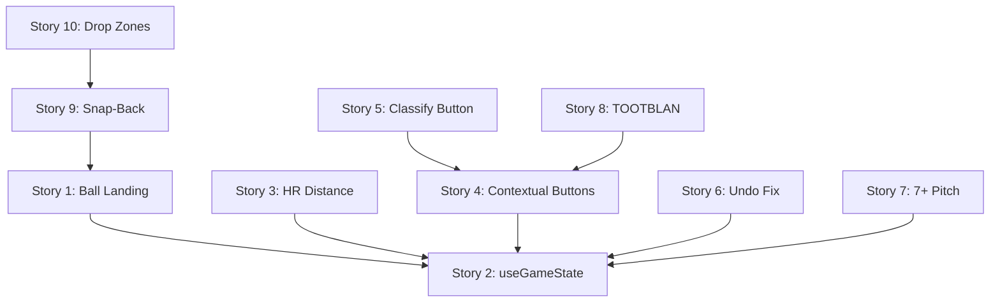

# GameTracker Drag-Drop Implementation Plan

> **Date**: 2026-01-31
> **Status**: READY FOR EXECUTION
> **Based On**: DRAGDROP_AUDIT_2026-01-31.md

---

## Priority Matrix

### P0 - Critical (Must Fix for MVP)
| # | Story | Impact | Effort |
|---|-------|--------|--------|
| 1 | Ball Landing Location Prompt | Spray charts broken without this | Medium |
| 2 | Wire useGameState Integration | No persistence without this | Medium |
| 3 | HR Distance Input | Park factors broken without this | Small |

### P1 - High (Core UX Per Spec)
| # | Story | Impact | Effort |
|---|-------|--------|--------|
| 4 | Contextual Special Event Buttons | Missing spec UX | Medium |
| 5 | Classify Play Button | Missing spec UX | Small |
| 6 | Fix Undo State Restoration | Undo doesn't work | Small |

### P2 - Medium (Feature Completeness)
| # | Story | Impact | Effort |
|---|-------|--------|--------|
| 7 | 7+ Pitch At-Bat Button | Missing feature | Small |
| 8 | TOOTBLAN Detection | Missing feature | Small |

### P3 - Low (Polish)
| # | Story | Impact | Effort |
|---|-------|--------|--------|
| 9 | Fielder Snap-Back Animation | Visual polish | Small |
| 10 | Drop Zone Visual Feedback | Visual polish | Small |
| 11 | Update CURRENT_STATE.md | Documentation | Tiny |

---

## Detailed User Stories

### Story 1: Ball Landing Location Prompt

**As a** game tracker user
**I want** to be prompted "Touch where the ball landed" after dragging batter to a base
**So that** the engine captures spray chart data for every hit

**Acceptance Criteria**:
- [ ] After batter dropped on safe zone at any base, show overlay prompt
- [ ] Overlay says "Touch where the ball landed" with translucent field view
- [ ] User taps location → location captured as `{ x, y }` normalized coords
- [ ] If tap is in foul territory, show warning and prompt again
- [ ] Location stored with hit record in `ballLocation` field
- [ ] Prompt auto-dismisses after capture OR can be skipped (for now)

**Technical Notes**:
- Add `BallLandingPrompt` component to EnhancedInteractiveField
- State: `showBallLandingPrompt: boolean`
- After batter drop → set state → render overlay → capture tap → store

**Files**: `EnhancedInteractiveField.tsx`

---

### Story 2: Wire useGameState Integration

**As a** developer
**I want** all play callbacks to persist to IndexedDB via useGameState
**So that** game data survives page refresh

**Acceptance Criteria**:
- [ ] `handleEnhancedPlayComplete` calls correct record functions:
  - `type: 'hit'` → `recordHit()` with hitType, location, RBIs
  - `type: 'out'` → `recordOut()` with outType, fielderSequence, location
  - `type: 'hr'` → `recordHit()` with type: 'homeRun', distance
- [ ] `handleEnhancedRunnerMove` → `advanceRunner()` with from, to, outcome
- [ ] `handleSpecialEvent` → `recordEvent()` with eventType
- [ ] Undo captures snapshot BEFORE each action
- [ ] All callbacks are async/await with error handling

**Technical Notes**:
- Review useGameState hook API
- Map PlayData to record function parameters
- Add try/catch with error toasts

**Files**: `GameTracker.tsx`, potentially `useGameState.ts`

---

### Story 3: HR Distance Input

**As a** game tracker user
**I want** to enter the exact HR distance after a home run
**So that** the engine can calculate park factors and distance metrics

**Acceptance Criteria**:
- [ ] After HR detected (drag past fence OR HR button), show distance modal
- [ ] Modal shows "Distance (ft)?" with numeric input
- [ ] Pre-populated with estimated distance based on y-coordinate (optional)
- [ ] User enters exact distance from SMB4 display
- [ ] Distance stored with HR record in `distance` field
- [ ] Input validation: 250-600 ft range

**Technical Notes**:
- Add `DistanceInputModal` component
- Show after `isInStands()` returns true
- Numeric input with mobile keyboard

**Files**: `EnhancedInteractiveField.tsx`

---

### Story 4: Contextual Special Event Buttons

**As a** game tracker user
**I want** to see relevant special event buttons after a play
**So that** I can quickly record Web Gems, Robberies, etc.

**Acceptance Criteria**:
- [ ] After play classification, check for applicable special events
- [ ] Render buttons in southern foul territory area:
  - Deep outfield catch (y > 0.8): `⭐ WEB GEM`
  - Wall catch (y > 0.95): `🎭 ROBBERY`
  - Pitcher fielded (1-X seq): `💥 KILLED` / `🥜 NUTSHOT`
  - Infield hit (y < 0.4): `🏃 BEAT THROW` / `🏏 BUNT`
  - Runner out non-force: `🤦 TOOTBLAN`
- [ ] One-tap confirmation (no modal)
- [ ] Buttons auto-dismiss after 3 seconds OR next action
- [ ] Tapping records event and dismisses

**Technical Notes**:
- Use `SpecialEventPrompt[]` from playClassifier result
- Add `ContextualEventButtons` component
- Position in foul territory below field
- Use setTimeout for auto-dismiss

**Files**: `EnhancedInteractiveField.tsx`, `playClassifier.ts`

---

### Story 5: Classify Play Button

**As a** game tracker user
**I want** to tap a "Classify Play" button to trigger play classification
**So that** I control when the engine analyzes my fielder sequence

**Acceptance Criteria**:
- [ ] "Classify Play" button appears after fielder is dragged
- [ ] Button shows fielder sequence so far (e.g., "6-4-3")
- [ ] Tapping button opens PlayClassificationModal
- [ ] If sequence is empty, button is disabled
- [ ] Button clears sequence after classification confirmed

**Technical Notes**:
- Add button to UI (bottom of field or foul territory)
- Only show when `fielderSequence.length > 0`
- Wire to existing modal logic

**Files**: `EnhancedInteractiveField.tsx`

---

### Story 6: Fix Undo State Restoration

**As a** game tracker user
**I want** the undo button to actually restore previous game state
**So that** I can fix mistakes

**Acceptance Criteria**:
- [ ] `handleUndo` callback receives `GameSnapshot`
- [ ] GameSnapshot.gameState is restored to useGameState
- [ ] UI updates to reflect restored state
- [ ] Toast shows "Undone: [description]"
- [ ] Undo count decrements

**Technical Notes**:
- Current implementation captures snapshots but `handleUndo` just logs
- Need to implement actual state restoration in `handleUndo`
- May need useGameState to support state replacement

**Files**: `GameTracker.tsx`, possibly `useGameState.ts`

---

### Story 7: 7+ Pitch At-Bat Button

**As a** game tracker user
**I want** a permanent "7+ PITCH" button
**So that** I can mark tough at-bats without pitch tracking

**Acceptance Criteria**:
- [ ] "7️⃣ 7+ PITCH" button always visible (permanent, not contextual)
- [ ] Tapping sets `sevenPlusPitch: true` on current at-bat
- [ ] Button visually toggles (shows ✓ when active)
- [ ] State resets when at-bat ends
- [ ] Stored with play record

**Technical Notes**:
- Add to permanent button row (with HR button)
- Toggle state in EnhancedInteractiveField
- Pass to play record on completion

**Files**: `EnhancedInteractiveField.tsx`

---

### Story 8: TOOTBLAN Detection

**As a** game tracker user
**I want** TOOTBLAN to be suggested when runner is out on non-force play
**So that** baserunning blunders are tracked

**Acceptance Criteria**:
- [ ] When runner out (from RunnerDragDrop), check if force play
- [ ] If NOT a force play, include TOOTBLAN in SpecialEventPrompts
- [ ] Show "🤦 TOOTBLAN?" button after play
- [ ] One-tap records TOOTBLAN event

**Technical Notes**:
- Need game context (bases occupied, outs)
- Add logic to detect force vs non-force
- Wire to contextual buttons

**Files**: `playClassifier.ts`, `EnhancedInteractiveField.tsx`

---

### Story 9: Fielder Snap-Back Animation

**As a** game tracker user
**I want** fielders to visually snap back to position after drop
**So that** I know where fielders are positioned

**Acceptance Criteria**:
- [ ] After fielder drop, show ball indicator at drop location for 1 second
- [ ] Fielder icon animates back to home position
- [ ] Animation duration: 300ms ease-out
- [ ] Ball indicator fades after 1 second

**Technical Notes**:
- Use Framer Motion for animation
- Add `ballIndicator` state with position
- Animate fielder position from drop to home

**Files**: `EnhancedInteractiveField.tsx`

---

### Story 10: Drop Zone Visual Feedback

**As a** game tracker user
**I want** to see highlighted drop zones during drag
**So that** I know where I can drop

**Acceptance Criteria**:
- [ ] During batter drag, highlight valid base safe/out zones
- [ ] Safe zones glow green, out zones glow red
- [ ] Zones only highlight when dragging
- [ ] Current drop target has stronger highlight

**Technical Notes**:
- Use useDrag monitor to detect drag state
- Conditionally render zone highlights
- CSS animations for glow effect

**Files**: `EnhancedInteractiveField.tsx`

---

### Story 11: Update CURRENT_STATE.md

**As a** developer
**I want** CURRENT_STATE.md to accurately reflect implementation status
**So that** the team doesn't waste time on already-done work

**Acceptance Criteria**:
- [ ] Phase 5 (Runners) marked as COMPLETE
- [ ] Phase 6 (Substitutions) marked as COMPLETE
- [ ] Phase 7 (Undo) marked as COMPLETE
- [ ] Document component locations
- [ ] Note integration gaps that remain

**Technical Notes**:
- Just documentation update
- Reference this audit for details

**Files**: `spec-docs/CURRENT_STATE.md`

---

## Sprint Planning Suggestion

### Sprint 1 (MVP Fixes)
- Story 1: Ball Landing Location Prompt
- Story 2: Wire useGameState Integration
- Story 3: HR Distance Input
- Story 11: Update CURRENT_STATE.md

### Sprint 2 (Core UX)
- Story 4: Contextual Special Event Buttons
- Story 5: Classify Play Button
- Story 6: Fix Undo State Restoration

### Sprint 3 (Feature Complete)
- Story 7: 7+ Pitch At-Bat Button
- Story 8: TOOTBLAN Detection
- Story 9: Fielder Snap-Back Animation
- Story 10: Drop Zone Visual Feedback

---

## Technical Dependencies

Story 2 (useGameState wiring) is the lynchpin - many features depend on it.

---

## Verification Checklist

After implementation, verify these spec requirements:

- [ ] Drag fielder to ball location captures spray chart
- [ ] Tap sequence builds throw chain (6-4-3)
- [ ] Batter drag to base prompts for ball location
- [ ] HR button prompts for location + distance
- [ ] Drag past fence triggers HR flow
- [ ] Foul territory auto-detected from coordinates
- [ ] Safe/out zones work for runners
- [ ] Special events show contextually
- [ ] Substitutions work via LineupCard
- [ ] Undo button restores state
- [ ] All plays persist to IndexedDB

---

*Implementation plan generated by Cowork - 2026-01-31*
